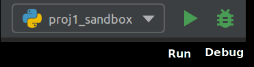

## PyCharm Installation (with a virtual environment)

### Why can't I just use the command line?
You totally can, but here's something to consider:

If you've used Python before, you probably feel like a cool hacker, switching between banging out script incantations on the command line and a sleek minimalist text editor. But during this MEAM 620, you will want high power debugging tools, such as breakpoints, inspecting variable values, interpreter managers, REPL, and so on. Additionally, you might want to up your software engineering skills, and utilize automatic code formatting, tab code completion, quick version control management and powerful refactoring tools.

Of course, at the end of the day, all you want to **write code faster**, and to **spend less time debugging**. *Integrated Development Environments*, or IDEs bundle together many tools listed above and more into a single program to have a seamless development experience. PyCharm is top IDE choice for Python, and we recommend you use it for MEAM620. Of course, for MEAM620 you can still just use the command line, text editor, and/or any other IDE you are already comfortable with, however we'll support you in this next section by helping you get this repository running in PyCharm specifically.

Once you go through these steps to get MEAM620 up and running, check out the [PyCharm Quick Start Guide](https://www.jetbrains.com/help/pycharm/quick-start-guide.html).


### Clone the Repository
If you have not yet cloned the repository, open a terminal and clone the repository:

```
git clone git@github.com:UPennMEAM620/meam620-2020.git
```

### Install PyCharm

[Download and install pycharm according to your installation](https://www.jetbrains.com/pycharm/download/). PyCharm Community should have all of the features you need, and does not require a license.

### Set up the PyCharm 620 Project
Now open PyCharm. In PyCharm, click *File > New Project*. A prompt will appear to select a *Location* and a *Project Interpreter*. Set the *Location* to the path to the git repository you just cloned, which should be something like `/home/.../meam620-2020`. For the *Project Interpreter*, click the carrot on the left to produce a drop down, which lets you select a *New Environment* or *Existing interpreter*.

We want to let PyCharm create a new virtual environment for us. Select the option for *New Environment using* and then select *Virtualenv* from the dropdown. Keep the Virtualenv location to default, and make sure *Base Interpreter* is set to Python 3 or 3.5.


There will be a final prompt saying `The directory '/home/.../meam620-2020' is not empty. Would you like to create a project from existing sources instead?` and click *Yes*, since we are using the existing git repository as our project folder.

You should be presented with a default project environment, which should look like the following:


### Finish installing the Virtualenv Python Interpreter
We still need to install our MEAM620 specific python packages. For this, we will use the PyCharm terminal. On the bottom of the screen, click the *Terminal* tab, and you should be presented with a terminal within PyCharm. Into the terminal, run the following command to have `pip` install MEAM620's packages using the virtualenv associated with this project:

```
pip install -e .
```


### Check installation
Now, let's check we've installed everything correctly and run the `sandbox.py`.

Click on the *Terminal* button in PyCharm, which will present a *Terminal* that is by default using the virtual environment we just created. We can check in the terminal which python environment we're using, and make sure it's the one we installed:

` $ which python
~/venv/my_new_venv/bin/python
`

Next we can try running the `sandbox.py` in the *Terminal*:

`python proj1/code/sandbox.py`

This should run the quadrotor simulator, generate some plots of results, and play an animation.

### Set up script configurations in PyCharm
PyCharm is a fully featured IDE and we would like to utilize it to run our Python scripts. In PyCharm, we run and debug scripts by setting up *Configurations* so PyCharm can call them for us. So let's set up a *Configuration* for `sandbox.py`.

In PyCharm, click on *Add Configuration...* near the top right of the screen. Click the *+* on the upper left, and select *Python*.

Now we're presented with a configuration screen. Fill in the *Name* with the name of the configuration, say `proj1_sandbox`. Change the *Script path* to `/home/rmli/meam620-2020/meam620-2020/proj1/code/sandbox.py`. You can also do stuff like add parameters (e.g. `python myscript -p parameter`), change the Python interpreter, or the working directory, but we don't need to worry about that right now.


Click *OK* to create the configuration.

Now click the green right arrow *Run* icon next to the configuration, which will run `sandbox.py` and should do the same thing as running it in *Terminal*.



The console output should appear at the bottom of the screen in the *Run* tab.

Click the red box *Stop* icon to stop the program.

The *Run* and *Stop* buttons allows PyCharm to give rich feedback when running your code. Configurations also lets you use the *Debug* button which is right next to the *Run* button.

Congratulations, you've installed MEAM620 on your computer!

Take a look at this [PyCharm Quick Start Guide](https://www.jetbrains.com/help/pycharm/quick-start-guide.html) to ensure you're making full use of your IDE.


## Contributing

Please create a new named feature branch for nontrivial commits. Delete the branch when the merge request is closed. Trivial fixes may be committed directly to master.
